# IBM CloudPak-DB2 - Data Engineering & SQL Queries

Jan 2022

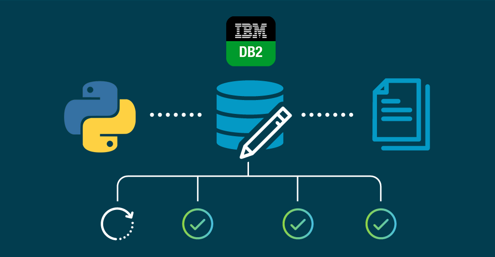

For this project I wanted to showcase my IBM Cloud-Pak Data Engineering skills, learnt from IBM's Data Engineering Foundations Certification (on Coursera). Using three datasets of Chicago (Chicago Census, Chicago Crime, and Chicago Public School datasets). The course showed us how to create and insert data using the Cloud Pak UI. But I wanted to push myself and make the databases strictly using Python code (no UI). I severely underestimated IBM Cloud Pak's ability to auto correct errors when inserting, one table had auto corrected 1995 warning/errors when inserting using the UI). I have my work cut out for me.

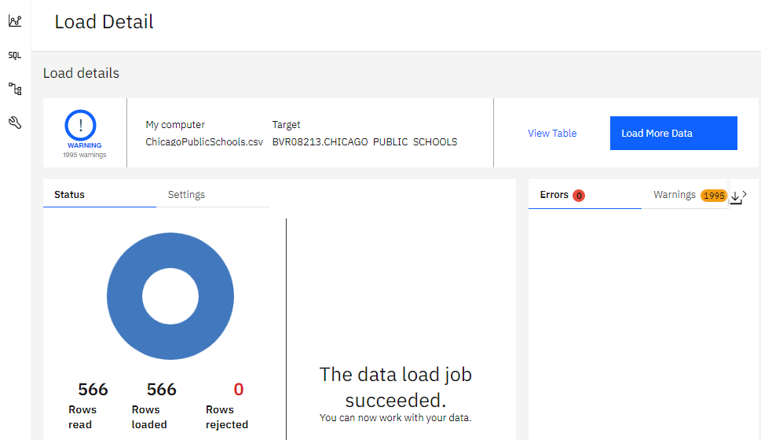

## What Did I Do?

### The Connection:

  -  I first needed to create a database on IBM Cloud Pak and retrieved the database's credentials (ie. database's name, database's user & password, etc.) needed to connect.

  -  For security purposes I stored all the sensitive database's information in a custom .py file. Allowing me to call each sensitive information without revealing them in my notebook, which would be public on Github, when constructing the connection.

  -  Using python's Magic command (%sql) I was able to connect with my IBM Db2 database using the hidden credentials.

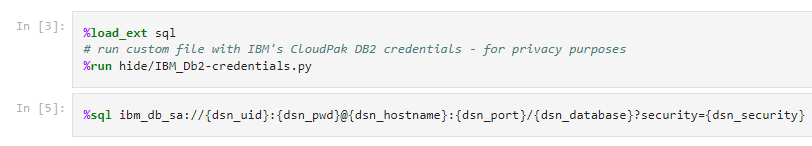

### Loading/Cleaning The Data:

  -  Loaded each dataset as separate pandas DataFrames.
  -  Dealt with variations of missing values and conflicts with column names and string values (errors later when inserting).
  -  Reassign correct data types to columns.

  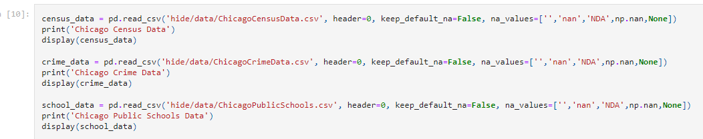

### Creating & Inserting Tables:

#### Creating Tables:
  -  Created a function to auto-create SQL "CREATE TABLE" statements; from a pandas dataframe. Needed some manual tweaking but worked great as a base to start with.
  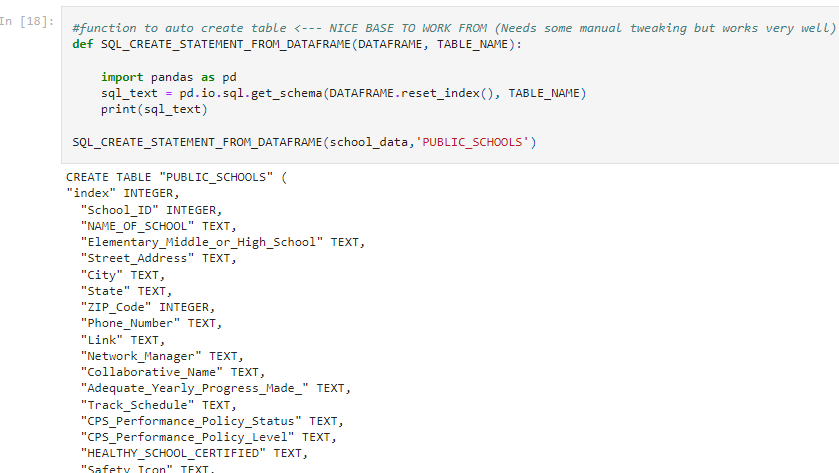

  -  Using %%sql command I created the three tables using the "CREATE TABLE" SQL statements.
  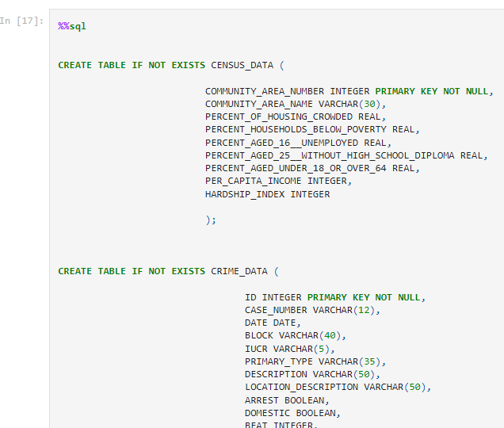

#### Inserting Tables:
  - Created a function to auto-create SQL "INSERT INTO" statements based on the dataframes. Again a great base to start with (needed some manual adjustments).
  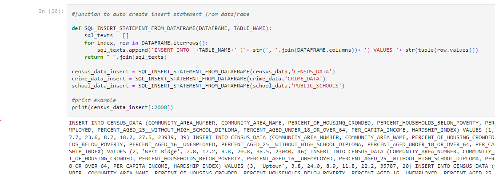
  - Inserted data into the corresponding tables using the modified SQL "INSERT INTO" statements created.
  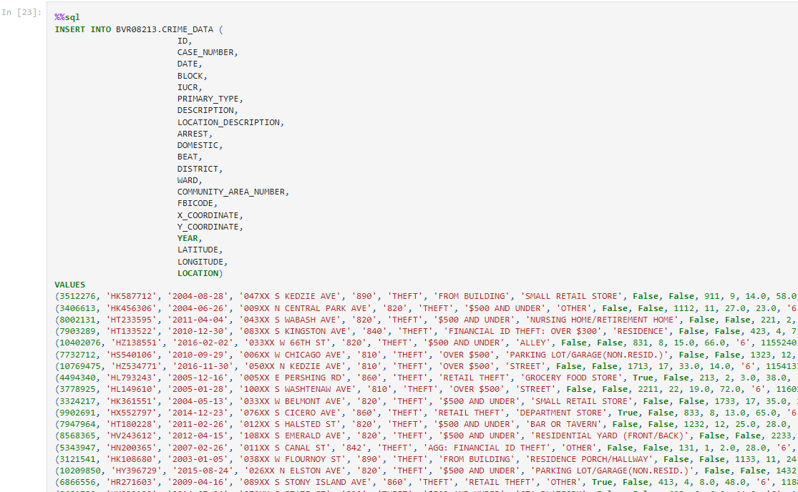

### Querying Data

  * Performed a few queries on the newly constructed Tables.
  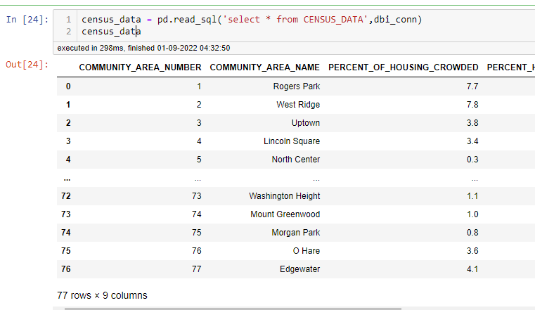

  * A few based on question
  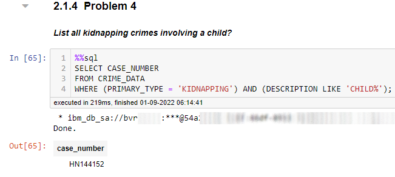
  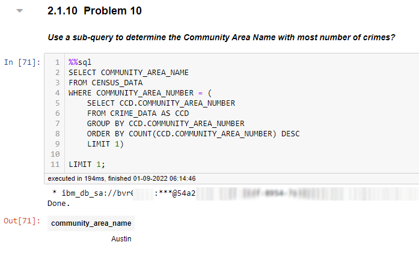

Hope You enjoyed my Data Engineering Project using IBM's Cloud DB2.

Please follow or add me on LinkedIn if you liked.

## Built With

* Python 3.8
* Jupyter Notebook 6.0.1
* IBM CloudPak - DB2
* The imports I used: pandas, numpy, ibm_db, ibm_dbi

## Authors

* **Samuel Diaz** - *Creator* - [sdman135](https://github.com/sdman135/) - [LinkedIn](https://www.linkedin.com/in/samuel-diaz-data-scientist)
